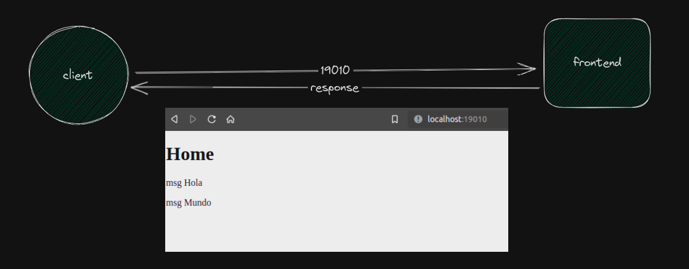
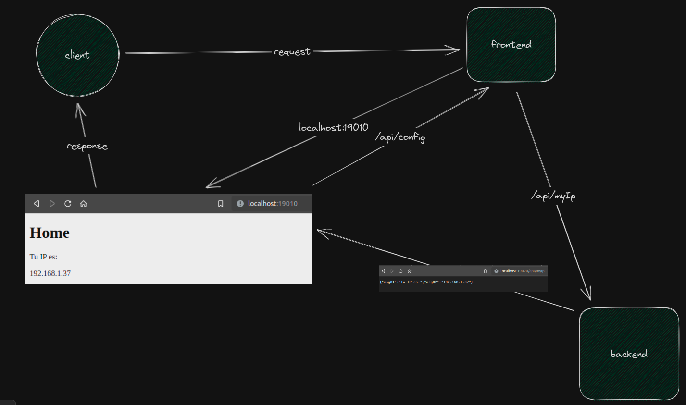

### Step1: Frontend project

```bash
mkdir frontend && cd frontend
npm init -y
npm i express
// Update scripts/start
npm start
```

<div align="center">
  
</div>

### Step2: Backend project

```bash
mkdir backend && cd backend
npm init -y
npm i express cors
// Update scripts/start
node .
```

<div align="center">
  
</div>
