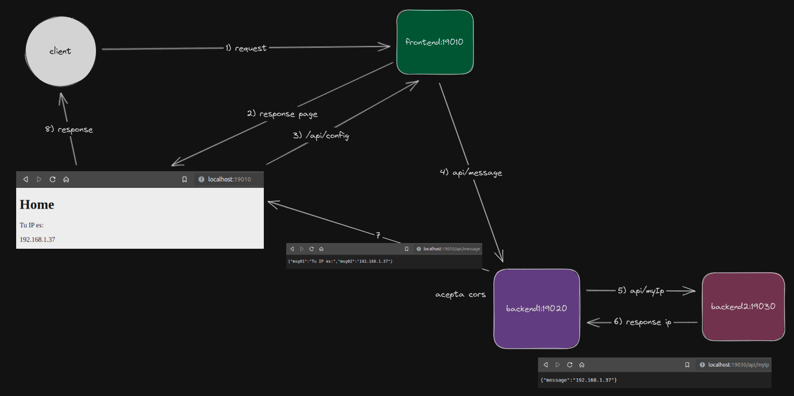
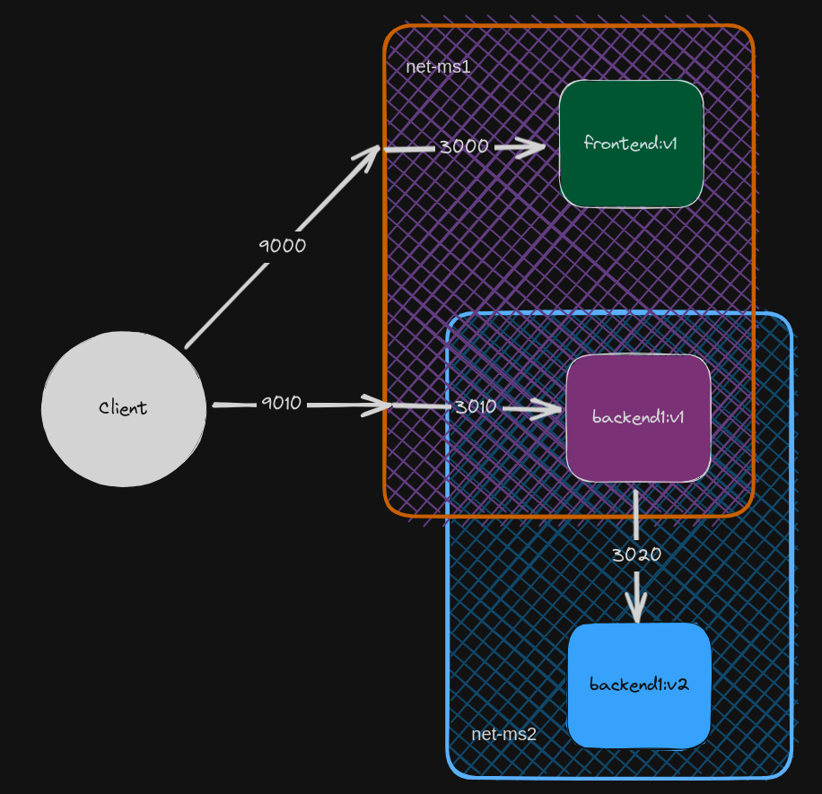
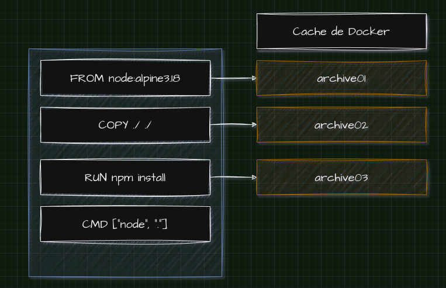
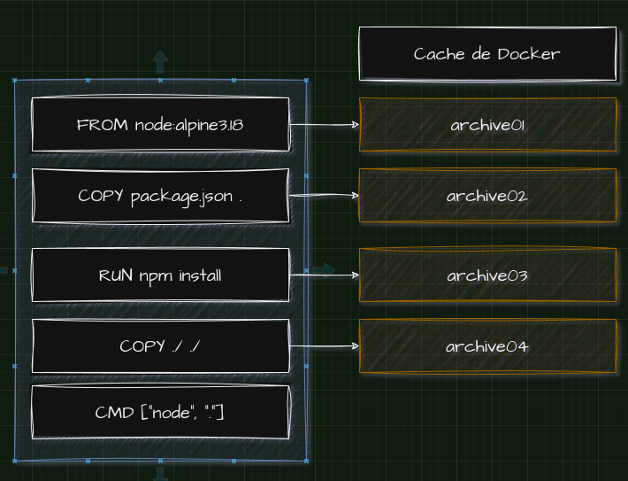
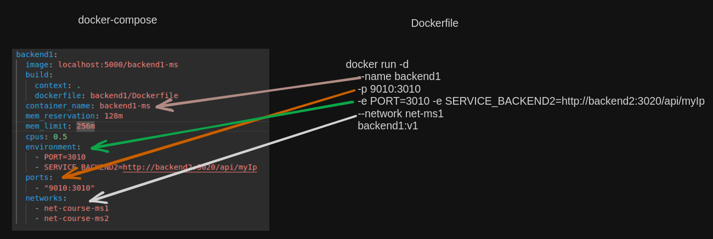
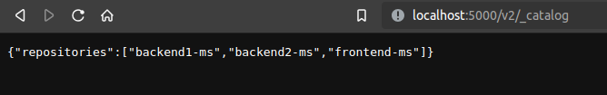

### Step1: Frontend project

```bash
mkdir frontend && cd frontend
npm init -y
npm i express
// Update scripts/start
npm start
```

<div align="center">
  
</div>

### Step2: Backend project

```bash
mkdir backend && cd backend
npm init -y
npm i express cors
// Update scripts/start
node .
```

<div align="center">
  
</div>

### Step3: Backend2

```bash
cd backend
npm i axios
cd ..
mkdir backend2 && cd backend2
npm init -y
npm i express
// Update scripts/start
node .
```

<div align="center">
  
</div>

### Step4: Containers

```bash
// En cada proyecto crear Dockerfile, con los siguientes pasos:
1. Instalar NodeJS
2. Copiar los archivos
3. Ejecutar `npm install`
4. Ejecutar el index.js

# Crear redes
docker network create net-ms1 -d bridge
docker network create net-ms2

# Crear imagen, correr contenedor y asociar a red (2) de backend2
docker build -t backend2:v1 .
docker run -d --name backend2 -e PORT=3020 backend2:v1
docker network connect net-ms2 backend2

# Crear imagen, correr contenedor y asociar a red (1) y (2) de backend1
docker build -t backend1:v1 .
docker run -d --name backend1 -p 9010:3010 -e PORT=3010 -e SERVICE_BACKEND2=http://backend2:3020/api/myIp --network net-ms1 backend1:v1
docker network connect net-ms2 backend1

# comprobar comunicación entre backend 1 y 2 en la red net-ms2
docker exec -it backend1 sh
/# apk add url
/# curl $SERVICE_BACKEND2
/# curl http://localhost:3010/api/message

# Crear imagen y correr contenedor de frontend en la red net-ms1
docker build -t frontend:v1 .
docker run -d --name frontend -p 9000:3000 -e PORT=3000 -e SERVICE_BACKEND1=http://localhost:9010/api/message --network net-ms1 frontend:v1

# Comandos extras
docker network disconnect net-ms frontend
docker network disconnect net-ms backend1
docker network disconnect net-ms backend2
docker stats
```

<div align="center">
  
</div>

### Step5: Docker Compose

#### Refactor Dockerfile

```
Cada vez que se hace un cambio en el código, "npm install" se vuelve a ejecutar. Eso no debe ser, porque no se hizo ningún cambio en la dependencia de librerías.
```

<div align="center">
  
</div>

```
El orden en los dockerfile debe ser el siguiente:
```

<div align="center">
  
</div>

#### Template docker-compose

<div align="center">
  
</div>

#### Registry local

```
- Run a Private Docker Registry
docker run -d -p 5000:5000 --restart always --name registry registry:2
  * localhost:5000 -> host for your docker private registry

- Push images to the Private Registry
1) docker:
docker push localhost:5000/backend1-ms

2) docker compose:
docker compose push
```

<div align="center">
  
</div>
