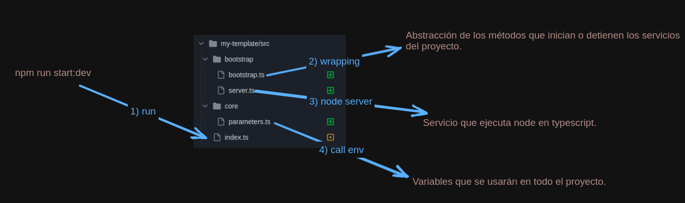

### 1) Agregar package.json

```
npm init -y
```

### 2) Agregar tsconfig.json

```
1) Instalar typescript en las dependencias de desarrollador
$ npm i typescript -D

2) Agregar tsc script a package.json
"scripts": {
   ...
   "tsc": "tsc"
},

3) Crear archivo tsconfig.json
$ npm run tsc -- --init
```

### 3) Compilar código

```
1) Modificar las salida de los archivos compilados en tsconfig.json
"compilerOptions": {
    ...
    "outDir": "./cache",            // archivos compilados, no mimificados
    ...
},

2) Compilar código typescript a javascript en la carpeta cache
$ npm run tsc

3) Librería para borrar carpetas
$ npm i rimraf -D

4) Cambiar script package.json
  "scripts": {
    "clean": "rimraf cache dist",
    "build": "npm run clean && tsc"     // borrar carpetas y luego compilar en cache
  },


```

### 4) Minificar código

```
1) Instalar gulp
$ npm i gulp gulp-uglify-es -D

2) Agregar archivo gulpfile.js
// los archivos js de la carpeta cache pasan por un proceso de minificación y el resultado se guarda en la carpeta dist.
const minify = () => src("./cache/**/*.js").pipe(uglify()).pipe(dest("./dist"));

3) Modificar script build package.json
"build": "npm run clean && tsc && gulp minify"
```

### 5) Ejecutar aplicación

```
1) Instalar definicionies de node para typescript
$ npm i -D @types/node

2) Agregar archivo index.ts
import http from "http";

const server = http.createServer((req, res) => {
  res.end("Hello World!");
});

server.listen(3000, () => {
  console.log("Server is listening on port 3000");
});

3) Ejecutar aplicación con typescript:
$ npx ts-node src/index.ts

4) Ejecutar applicación con javascript:
$ npm run build
$ node dist/index.ts
```

### 6) Reload apllicación con nodemon

#### 6.1) Instalar nodemon

```
$ npm i -D nodemon
```

#### 6.2) Añadir nodemon.json

#### 6.3) Agregar start dev en package.json

```
"start:dev": "nodemon src/index.ts"
```

#### 6.4) Ejecutar aplicación con nodemon

```typescript
$ npm run start:dev
```

### 7) Bootstrap de aplicación

<div align="center">
  
</div>
